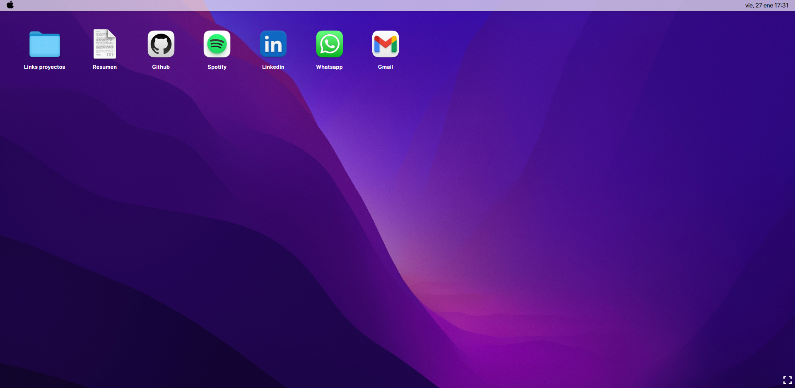
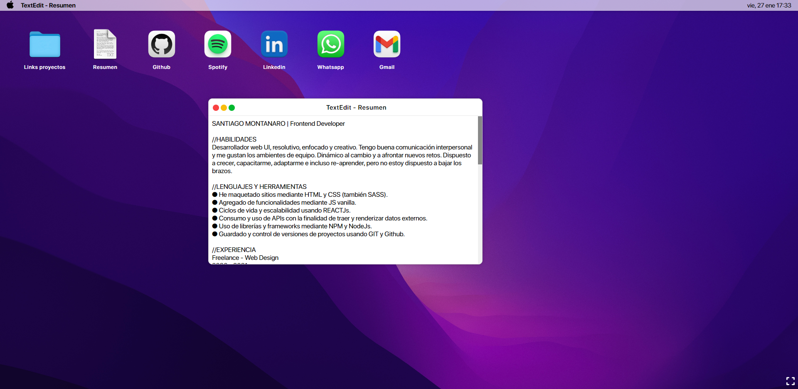

# Bienvenido a mi anexo de links de interés 🥳

Hecho con [React](https://es.reactjs.org/), [React Router](https://reactrouter.com/web/guides/quick-start) y CSS Modules.

## ¿Qué es esto? 🤯

Es un anexo que funciona a modo de portafolio, donde se muestran mis proyectos y links de interés y contacto. 

### ¿Cómo funciona? 🤔

Es super sencillo!
- La carpeta 'Proyectos' contiene proyectos en los que he trabajado.
- El archivo de texto 'Resumen' contiene mi C.V. por si te interesa.
- Por ultimo están los links de interés que te van a direccionar a mis respectivos links de contacto y redes.

# Gracias por ver!
_____________________________________________________________________

# Welcome to my annex of links of interest 🥳

Made with [React](https://es.reactjs.org/), [React Router](https://reactrouter.com/web/guides/quick-start) and CSS Modules.

## What is this? 🤯

It is an annex that works as a portfolio, where my projects and links of interest and contact are shown.

### How does this work? 🤔

It's super simple!
- The 'Projects' folder contains projects I've worked on.
- The text file 'Resume' contains my C.V. if you're interested.
- Finally, there are the links of interest that will direct you to my respective contact links and socials.

### Imagenes de demostración / Demo images

# Thanks for watching!

## Hecho por / Made by [Santiago Montanaro]